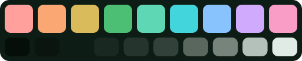
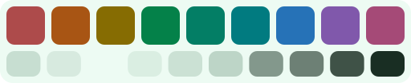

<div align="center">


# Paleta Nephrite

[English](README.md) · **Español**

Tres sabores jade con diez neutros y nueve acentos minerales. La base de cada port de Nephrite.

[](LICENSE.es.md)
[](https://getnephrite.dev/es/palette)

</div>

## Sabores

| Sabor | Vista | Para |
| --- | --- | --- |
| **Forest** |  | Oscuro y profundo, para la noche |
| **Jade** |  | Oscuro con más verde, para jornadas largas |
| **Mint** |  | Claro y ligero, para el día |

Los neutros tienen un leve tinte jade, y cada acento supera 4.5:1 de contraste sobre el `base` de su sabor. Pruébalos en [getnephrite.dev/es/palette](https://getnephrite.dev/es/palette).

## Colores

| Nombre | Forest | Jade | Mint |
| --- | --- | --- | --- |
| crust | `#050e09` | `#0b1d13` | `#c7ded1` |
| mantle | `#09150e` | `#0e2419` | `#d7eadf` |
| base | `#0d1c14` | `#132e20` | `#edfbf3` |
| surface0 | `#192820` | `#20392c` | `#daeee2` |
| surface1 | `#25342c` | `#2e4639` | `#cbe1d4` |
| surface2 | `#324139` | `#3c5346` | `#bdd5c7` |
| overlay0 | `#59675f` | `#63776c` | `#83988c` |
| overlay1 | `#76847c` | `#7f9187` | `#6d8075` |
| subtext | `#b4c1ba` | `#bdccc3` | `#3f5247` |
| text | `#e0ebe5` | `#e7f2eb` | `#192e23` |
| garnet | `#ffa09c` | `#ffaaa7` | `#ad4b4b` |
| carnelian | `#fba773` | `#ffaf7e` | `#a85514` |
| citrine | `#d9bb5c` | `#e0c262` | `#866c02` |
| jade | `#4dbf74` | `#4dbf74` | `#048149` |
| mint | `#5ed7b5` | `#65ddbb` | `#037e65` |
| lagoon | `#43d5dc` | `#4cdbe3` | `#017b80` |
| sapphire | `#89c3fe` | `#96c9fe` | `#2672b7` |
| amethyst | `#d0aafc` | `#d5b2ff` | `#8058ab` |
| rhodonite | `#f99dc6` | `#fea4cc` | `#a54a77` |

## Uso

### CSS

```css
@import "@nephrite-theme/palette/css";

body {
  background: var(--nephrite-base);
  color: var(--nephrite-text);
}
```

Forest es el sabor por defecto. Cambia de sabor con un atributo: `<html data-nephrite="mint">`. Los archivos de un solo sabor están en `@nephrite-theme/palette/css/forest` (y `jade`, `mint`).

### SCSS

```scss
@use "@nephrite-theme/palette/scss" as nephrite;

.button {
  background: map-get(nephrite.$nephrite-forest, "jade");
}
```

### JavaScript y TypeScript

```js
import { flavors, ansi } from "@nephrite-theme/palette";

flavors.forest.colors.jade; // "#4dbf74"
flavors.mint.dark; // false
ansi.red; // "garnet"
```

Incluye tipos (`FlavorName`, `ColorName`, `Flavor`).

### Sin npm

Todos los formatos están en [`dist/`](dist), así que puedes copiar un archivo o cargarlo desde un CDN:

```html
<link rel="stylesheet" href="https://cdn.jsdelivr.net/gh/Nephrite-theme/palette@main/dist/palette.css">
```

> [!NOTE]
> El paquete de npm todavía no está publicado. Mientras tanto, usa los archivos de `dist/` o el enlace al CDN de arriba.

## Crear un port

Usa los colores por su función, para que todos los ports de Nephrite se sientan de la misma piedra:

| Función | Color |
| --- | --- |
| Fondo principal | `base` |
| Barras laterales, paneles, pestañas inactivas | `mantle` |
| Bordes, barras de título, la capa más profunda | `crust` |
| Hover, selección, superficies elevadas | `surface0` a `surface2` |
| Comentarios, texto deshabilitado, números de línea | `overlay0`, `overlay1` |
| Texto secundario | `subtext` |
| Texto principal | `text` |
| Acento principal: enlaces, foco, cursor, elementos activos | `jade` |
| Errores, eliminaciones | `garnet` |
| Advertencias | `citrine` |
| Adiciones, éxito | `jade` o `mint` |
| Información | `sapphire` o `lagoon` |

### Resaltado de sintaxis

| Token | Color |
| --- | --- |
| Palabras clave | `amethyst` |
| Strings | `jade` |
| Funciones | `sapphire` |
| Tipos, clases | `citrine` |
| Números, constantes | `carnelian` |
| Propiedades, claves de objetos | `lagoon` |
| Escapes en templates y regex | `rhodonite` |
| Comentarios | `overlay1` |
| Puntuación | `subtext` |

### Terminal

`palette.json` incluye un mapeo ANSI sugerido (`ansi`): rojo es `garnet`, verde `jade`, amarillo `citrine`, azul `sapphire`, magenta `amethyst`, cian `lagoon`, y el negro y el blanco salen de los neutros.

## Cambiar la paleta

`palette.json` es el único archivo que se edita. Después, regenera todos los formatos:

```sh
npm run build
```

El build no tiene dependencias y regenera `dist/` y las muestras de `assets/`.
